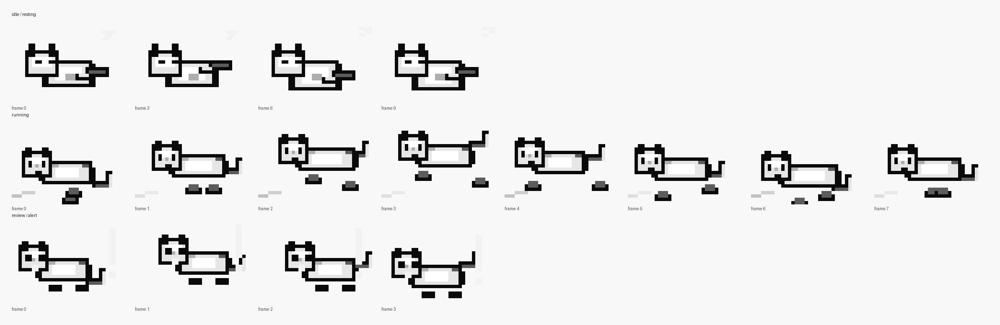
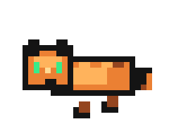
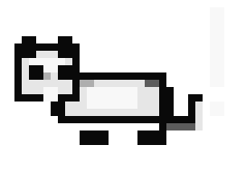

# Codex Cat Status

A tiny macOS menu bar companion for Codex Desktop. It replaces a plain status indicator with an animated pixel cat that reflects what Codex is doing.



Codex Cat Status does not modify `/Applications/Codex.app`. It runs as a separate menu bar app, reads local Codex state under `~/.codex`, and turns that state into three simple visual signals:

- Running: at least one recent Codex conversation is actively thinking, writing, or running a tool.
- Resting: no recent Codex conversation is currently active.
- Alert: Codex is waiting for a concrete approval action, such as an escalated command request.
- Token display: a compact battery-style estimate of remaining context is shown next to the cat.

## States

| Resting | Running | Approval needed |
| --- | --- | --- |
|  |  |  |
| No active Codex turn is running. | A Codex turn has started and has not completed. | A pending command explicitly requests approval. |

## How It Works

The app infers status from local Codex files because Codex Desktop does not expose a public menu bar status API.

The menu item shows the signal counts used for the current state:

- `conversation`: recent Codex sessions whose latest turn has started and has not yet written `task_complete`.
- `pending`: unfinished tool or command calls in active Codex turns.
- `jobs`: active local agent or automation jobs.
- `review`: unfinished approval-required commands or explicit review/approval jobs.

The alert state intentionally avoids broad text matching. It only appears when there is a pending command whose arguments explicitly request `sandbox_permissions=require_escalated`, or when Codex local job state explicitly says review/approval is needed. Normal thinking, writing, and tool use stays in the running state.

## Token Display

The indicator next to the cat is the estimated remaining context window for the latest observed Codex turn, based on Codex `token_count` events:

- Menu bar: battery-style remaining context percentage, for example `[###---] 42%`.
- Tooltip: current turn tokens, locally observed today/week token totals, and 5-hour/7-day quota windows with battery-style percentage bars when Codex reports them.
- Menu: a compact token summary alongside the conversation/job counts.

This is local telemetry from `~/.codex/sessions`, not an official billing or quota API. Today/week totals are best-effort sums of locally observed `last_token_usage` events. Values can differ from Codex's own UI because Codex may display thread-specific live context, account-level limits, or server-side usage state that is not fully exposed in local session logs.

## Build

```sh
sh build.sh
```

This creates `CodexCatStatus.app` in the project directory.

## Run

```sh
open CodexCatStatus.app
```

The cat appears in the macOS menu bar. Use the menu item `Quit Codex Cat` to stop it.

## Generate Previews

```sh
python3 generate_previews.py
```

This regenerates the PNG/GIF assets in `previews/`.

## Notes

- Designed for macOS and Codex Desktop.
- Reads local state only; it does not send data anywhere.
- Logs lightweight status checks to `/tmp/codex-cat-status.log`.
- Status is best-effort because it depends on Codex's local session files and SQLite state.
